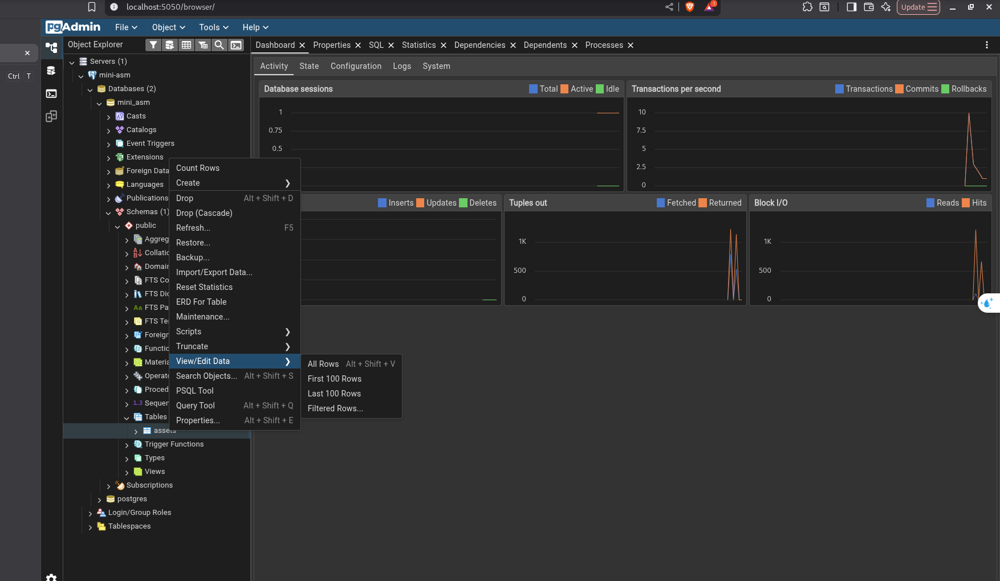

# Mini ASM — Attack Surface Management API

API quản lý tài nguyên mạng (domain, IP, service) với CRUD operations đầy đủ.

**Tech Stack:** Python 3.13 · FastAPI · PostgreSQL 15 · Docker

## 🚀 Quick Start

### Yêu cầu

- Python 3.10+
- Docker + Docker Compose plugin (`docker compose`)

### 1. Tạo virtual environment (chỉ cần chạy 1 lần)

```bash
make venv
```

> Lệnh này tạo folder `.venv/` và cài tất cả dependencies từ `requirements.txt`.
> Không cần chạy lại trừ khi xóa `.venv/` hoặc thêm dependency mới.

### 2. Khởi động database

```bash
make db-start
```

> Lần đầu tiên chạy sẽ tự động:
> - Tạo PostgreSQL + pgAdmin containers
> - Tạo bảng `assets` + indexes
> - Thêm 17 assets mẫu (seed data)

### 3. Chạy server

```bash
make run
```

Server:

- **Swagger UI:** http://localhost:8080/docs — test API trực tiếp trên trình duyệt
- **pgAdmin:** http://localhost:5050 (email: `admin@admin.com` / password: `admin`)

### 🔌 Kết nối pgAdmin để xem database trực quan

Sau khi đăng nhập pgAdmin, cần tạo server connection:

1. Click **"Add New Server"**
2. Tab **General** → Name: `mini-asm`
3. Tab **Connection**:
   - Host: `db` (tên Docker service, không phải localhost)
   - Port: `5432`
   - Username: `postgres`
   - Password: `postgres`
   - ✅ Save password
4. Click **Save** → mở tree: **Servers → mini-asm → Databases → mini_asm → Schemas → public → Tables → assets**



## 📖 API Endpoints

| Method | Path | Mô tả |
|--------|------|-------|
| GET | `/health` | Health check + database status |
| POST | `/assets` | Tạo asset mới |
| POST | `/assets/batch` | Tạo nhiều asset (transaction) |
| GET | `/assets` | Liệt kê với pagination + filter |
| GET | `/assets/stats` | Thống kê tổng quan |
| GET | `/assets/count` | Đếm asset theo filter |
| GET | `/assets/search?q=...` | Tìm kiếm theo tên |
| GET | `/assets/{id}` | Lấy asset theo ID |
| PUT | `/assets/{id}` | Cập nhật asset |
| DELETE | `/assets/{id}` | Xóa asset |
| DELETE | `/assets/batch?ids=...` | Xóa nhiều asset |

## 🛠️ Makefile Commands

```bash
make help     # Xem tất cả lệnh có sẵn
```

### Database

```bash
make db-start       # Khởi động PostgreSQL + pgAdmin
make db-stop        # Tắt (data vẫn còn)
make clean          # Xóa containers + volumes (reset toàn bộ DB)
```

### Migrations & Data

```bash
make migrate-up     # Tạo bảng assets
make migrate-down   # Xóa bảng assets
make seed           # Thêm 17 assets mẫu
make seed-rollback  # Xóa dữ liệu mẫu (DB rỗng)
```

> **Note:** Nếu muốn bắt đầu với DB rỗng (không có data mẫu), chạy `make seed-rollback` sau khi `make db-start`.

### Tiện ích

```bash
make db-tables      # Xem danh sách bảng
make db-assets      # Xem tất cả assets
make db-shell       # Mở psql shell
```

## 📝 Tài liệu

- **Đề bài & yêu cầu chi tiết:** [homework.md](homework.md)
- **Kết quả bài nộp & screenshots:** [SUBMISSION.md](SUBMISSION.md)
