# Homework Submission

**Họ tên:** Nguyễn Trường Giang

## Các bài đã hoàn thành

- [x] Bài 1: Statistics APIs
- [x] Bài 2: Batch Create
- [x] Bài 3: Batch Delete
- [x] Bài 4: Connection Retry
- [x] Bài 5: Health Check
- [x] Bài 6: Pagination (Bonus)
- [x] Bài 7: Search (Bonus)

---

## Bài 1: Statistics APIs (20 điểm)

### 1.1 GET /assets/stats

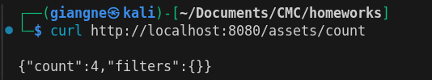

### 1.2 GET /assets/count

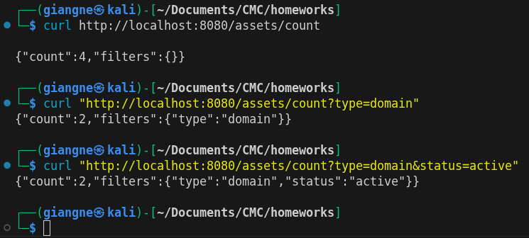

---

## Bài 2: Batch Create Assets (25 điểm)

### 2.1 Success Case — Tạo batch 2 assets thành công (201)

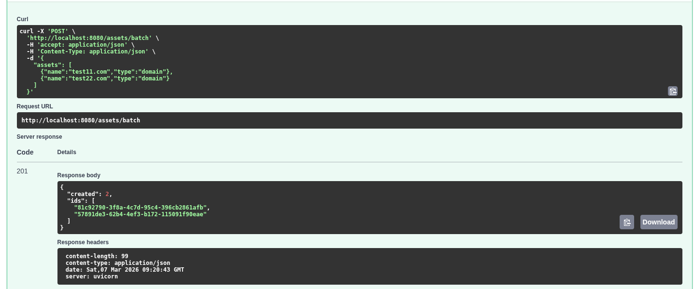

### 2.2 Error Case — Empty name bị reject (400)

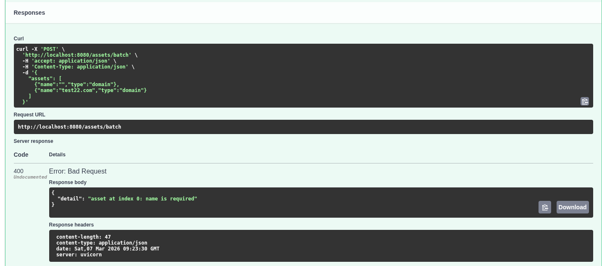

### 2.3 Error Case — Empty list bị reject (400)

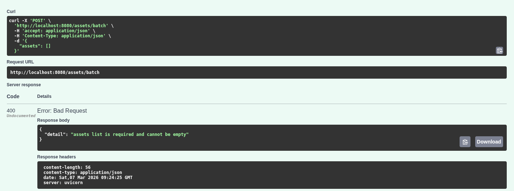

### 2.4 Error Case — Invalid type bị reject (422)

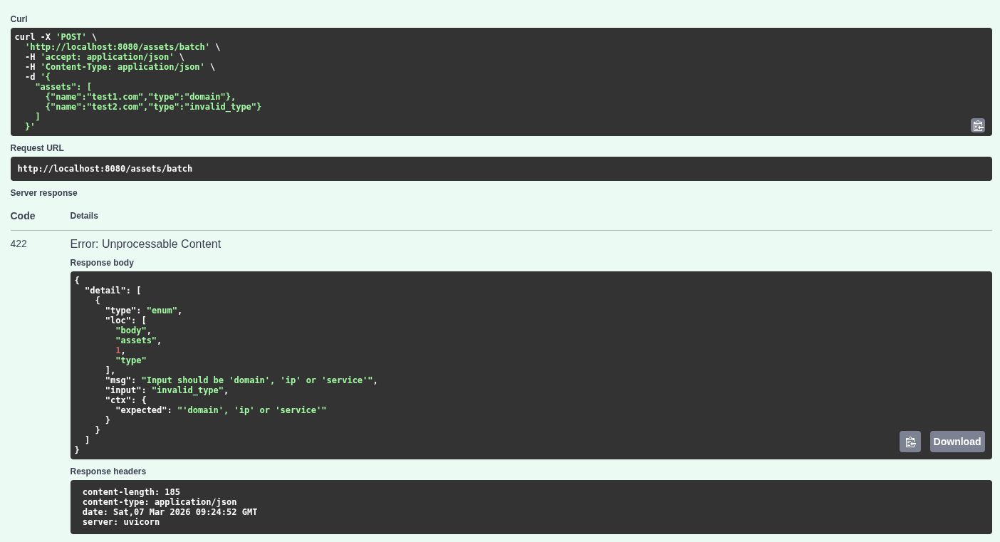

---

## Bài 3: Batch Delete Assets (20 điểm)

### 3.1 Batch Delete — Xóa 2 asset thật + 1 fake ID (200)

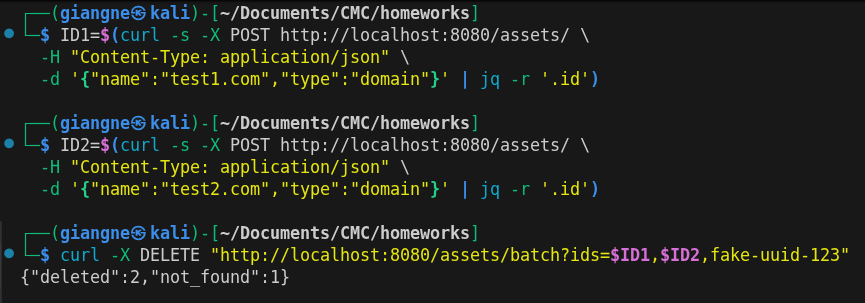

### 3.2 Verify Deletion — Asset đã xóa trả về 404

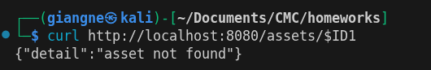

---

## Bài 4: Database Connection Retry (25 điểm)

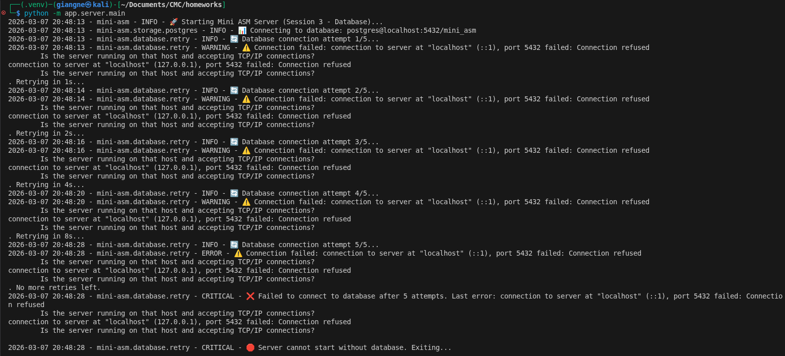

Cái này phải mở thêm 1 terminal để chờ tầm 3 giây rồi mới docker compose up
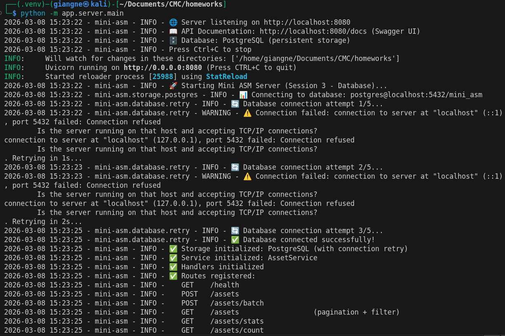

---

## Bài 5: Database Health Check (15 điểm)

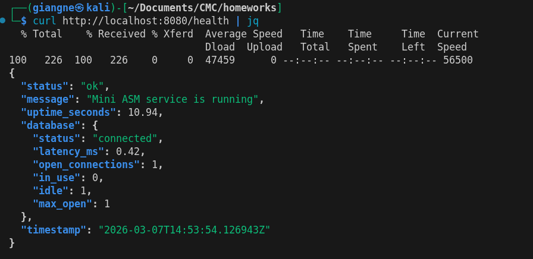

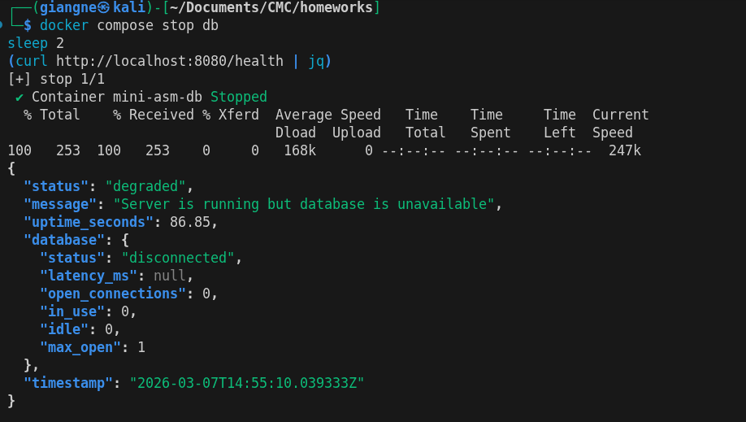

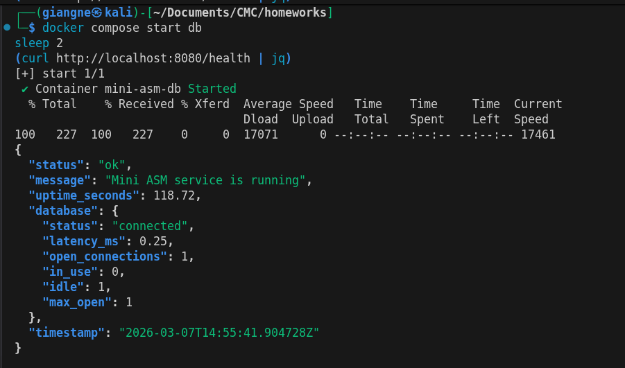

---

## Bài 6: Pagination & Filtering (15 điểm) - BONUS 🌟

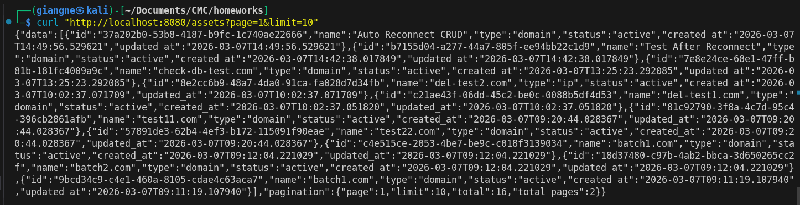

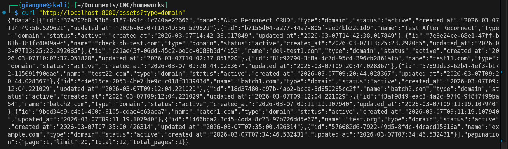

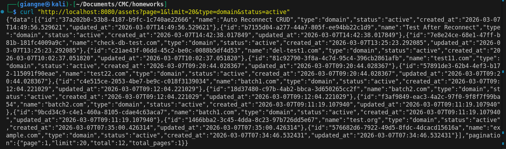

---

## Bài 7: Search by Name (10 điểm) - BONUS 🌟

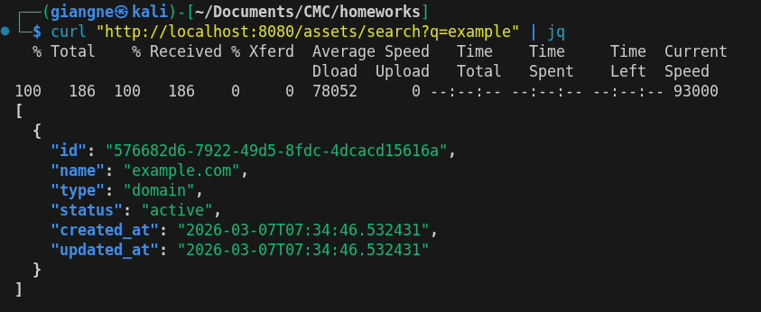

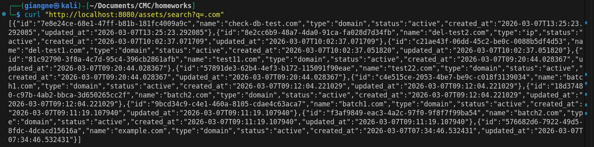

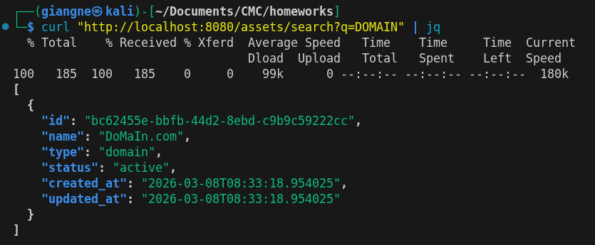
