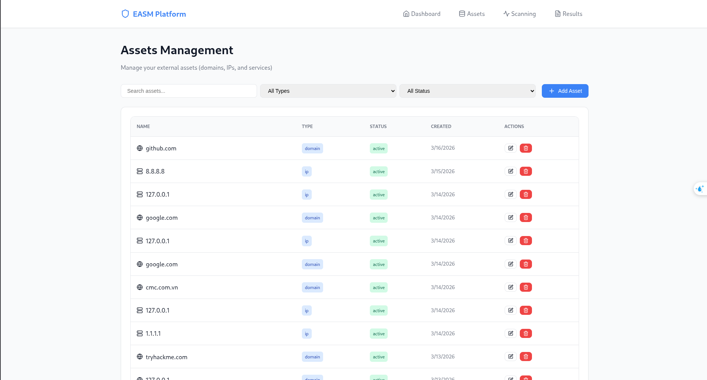
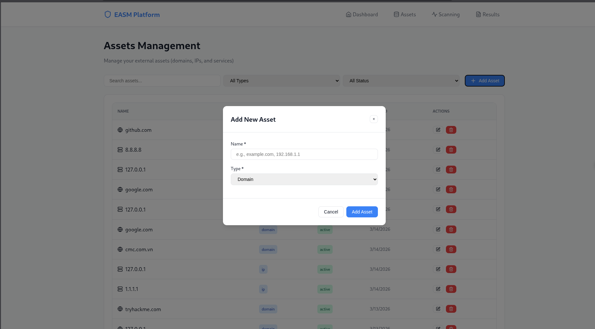
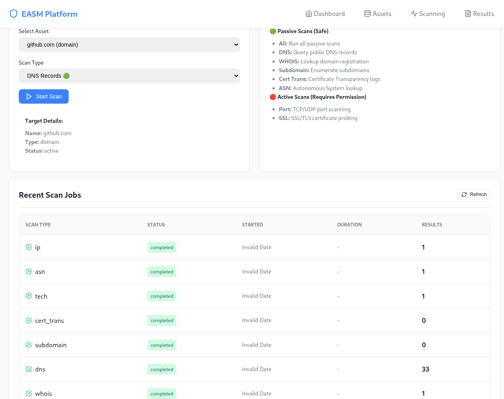
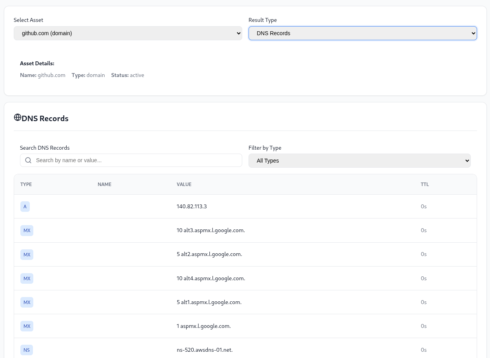
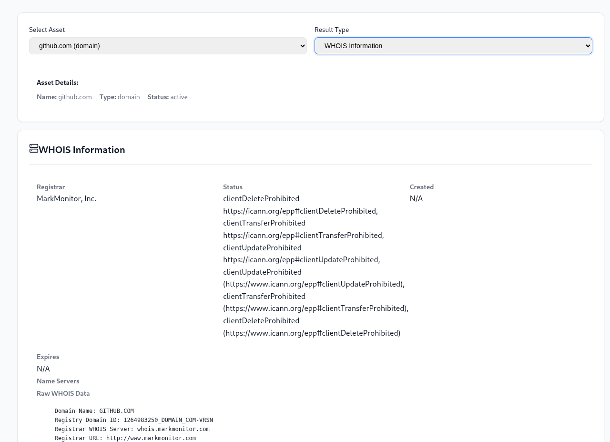
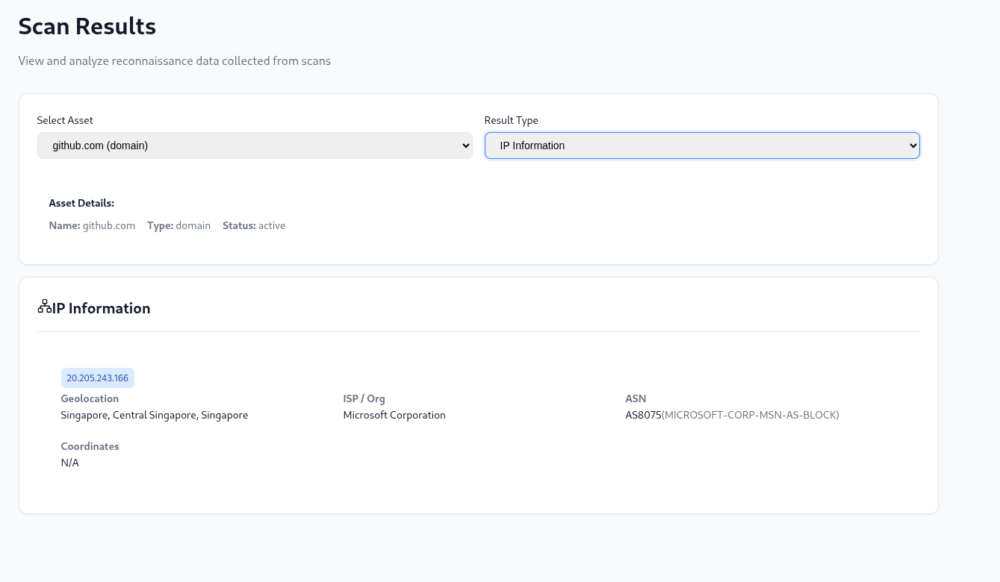
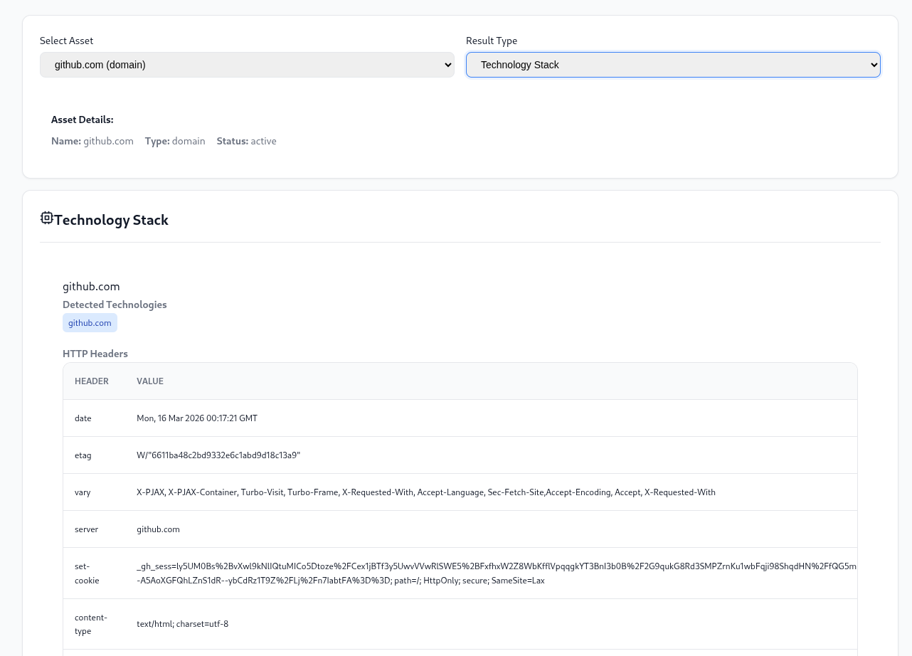
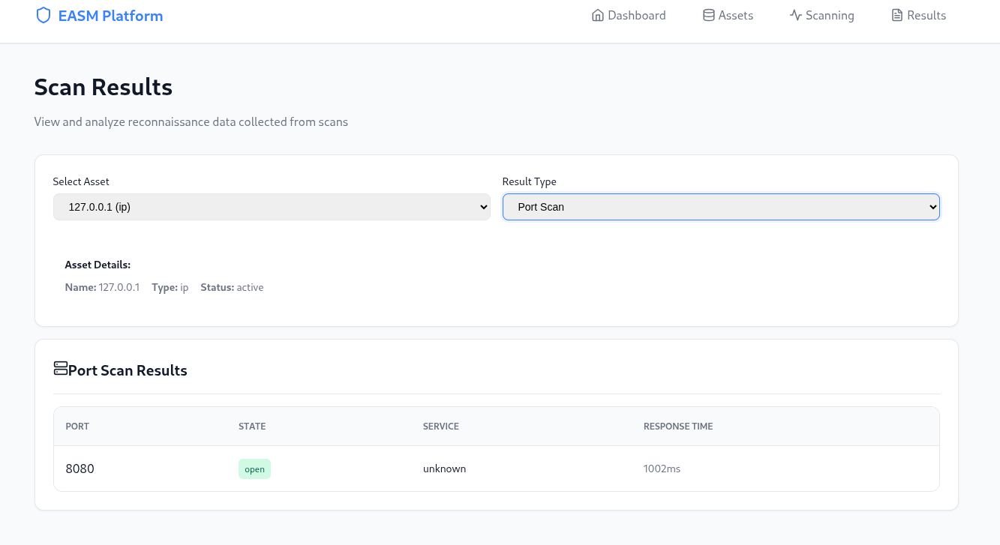
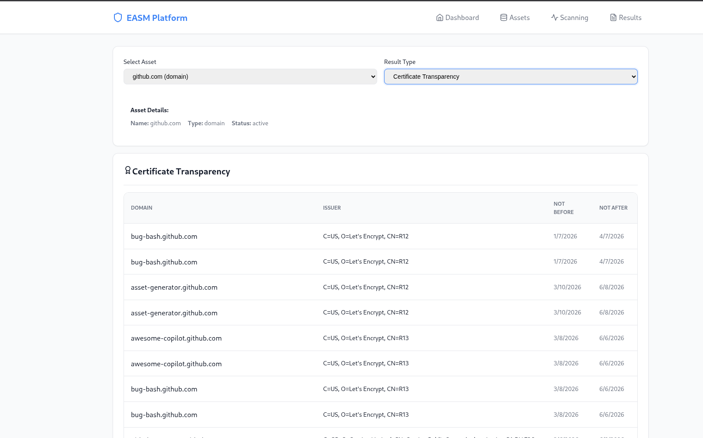

Bài 3: Tích hợp Frontend

**Nhiệm vụ:** Kết nối backend API với frontend và đảm bảo các tính năng hoạt động đúng yêu cầu.

## 1. Hiển thị danh sách Assets
Trang quản lý Asset đã hiển thị đầy đủ danh sách các tên miền (domain) và địa chỉ IP đã được thêm vào hệ thống.
- Link: `http://localhost:3000/assets`
- Trạng thái: **Hoàn thành**

## 2. Thêm Asset mới
Tính năng thêm Asset (Domain/IP) qua Modal đã hoạt động ổn định, dữ liệu được lưu vào Database và cập nhật ngay lập tức lên giao diện.
- Trạng thái: **Hoàn thành**

## 3. Khởi tạo Scan và Xem kết quả
Hệ thống đã tích hợp 8 loại Scan khác nhau. Kết quả trả về từ Backend được render chi tiết theo từng loại record.
- **Tiến trình quét:** Các Job được hiển thị trạng thái `completed` kèm theo số lượng kết quả tìm thấy.
- **Dữ liệu hiển thị:** Chỉ hiển thị kết quả của lần quét gần nhất (Latest result only) để tránh trùng lặp thông tin cũ.

### 3.1 Giao diện Scanning

### 3.2 Kết quả DNS
Hiển thị đầy đủ các bản ghi A, MX, NS, TXT... của Asset.

### 3.3 Kết quả WHOIS
Hiển thị thông tin nhà đăng ký, trạng thái tên miền và các ngày quan trọng.

### 3.4 Kết quả IP Information
Hiển thị thông tin địa chỉ IP, Geolocation, ASN và Reverse DNS.

### 3.5 Kết quả Technology Stack
Hiển thị các công nghệ máy chủ, framework, CMS... được phát hiện.

### 3.6 Kết quả Port Scan
Hiển thị các port đang mở và dịch vụ web đang chạy trên mục tiêu.

### 3.7 Kết quả Certificate Transparency
Hiển thị lịch sử các chứng chỉ SSL/TLS đã từng được cấp phát trên Certificate Transparency Logs.

## Kết luận
Toàn bộ các tính năng yêu cầu trong Bài 3 bao gồm hiển thị, thêm, xóa asset và xem kết quả scan đã được tích hợp thành công giữa Frontend (React/Vite) và Backend (FastAPI).
