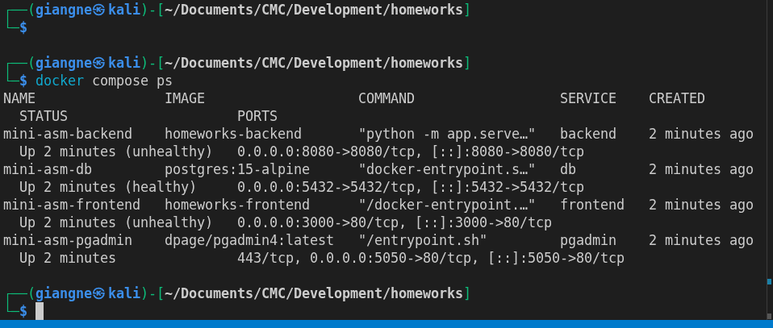
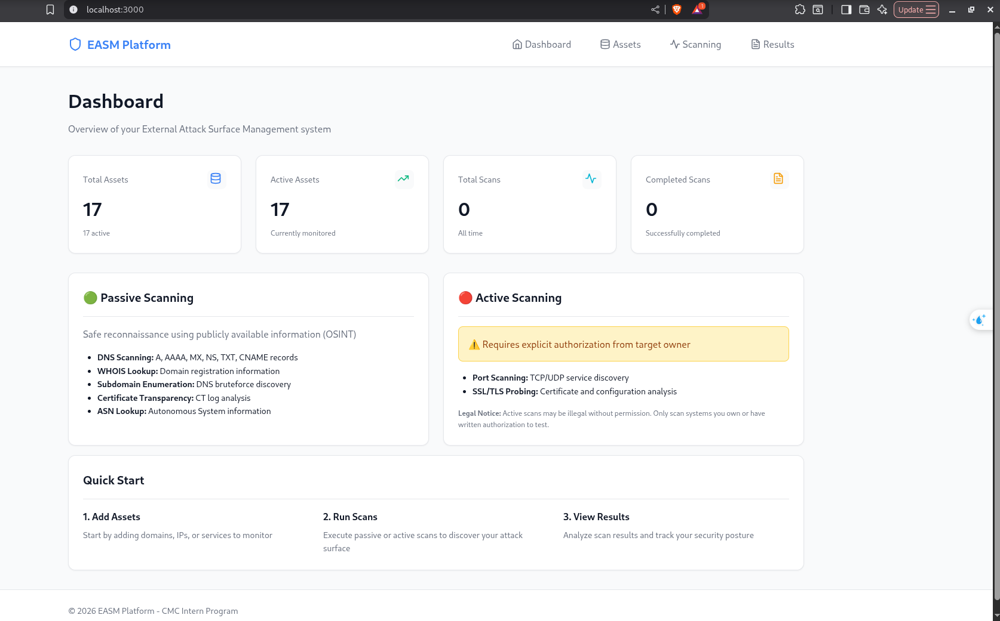
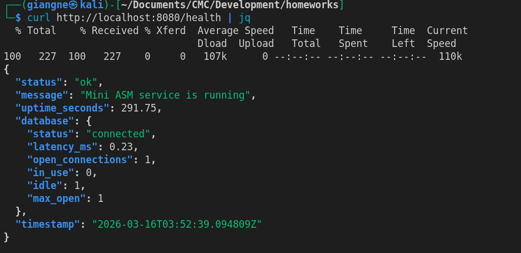

# Bài 5: Deploy với Docker Compose

Nhiệm vụ này thực hiện triển khai toàn bộ hệ thống (Frontend, Backend, Database) sử dụng Docker Compose để đảm bảo tính nhất quán và dễ dàng vận hành.

## 1. Trạng thái các dịch vụ (Docker Compose PS)

Sử dụng lệnh `docker compose ps` để kiểm tra trạng thái của toàn bộ stack. Tất cả các container bao gồm Backend, Frontend, Database và pgAdmin đều đã được khởi chạy thành công.

## 2. Truy cập Frontend

Ứng dụng Frontend được triển khai tại port 3000. Giao diện Dashboard hiển thị chính xác các thông tin tổng quan về Assets và quá trình Scanning.

## 3. Backend Health Check

Xác nhận Backend hoạt động ổn định và kết nối thành công với cơ sở dữ liệu PostgreSQL thông qua endpoint `/health`. Kết quả trả về JSON với trạng thái `ok` và Database `connected`.

## Kết luận

Hệ thống đã được đóng gói và triển khai thành công dưới dạng các container Docker. Việc tích hợp giữa các thành phần diễn ra mượt mà, sẵn sàng cho việc đưa vào sử dụng thực tế.