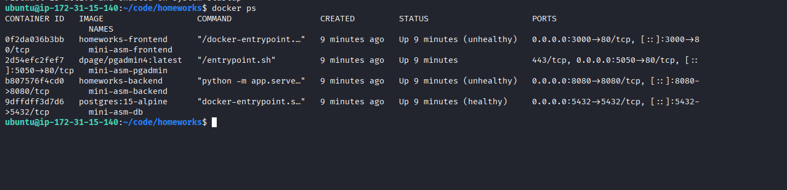
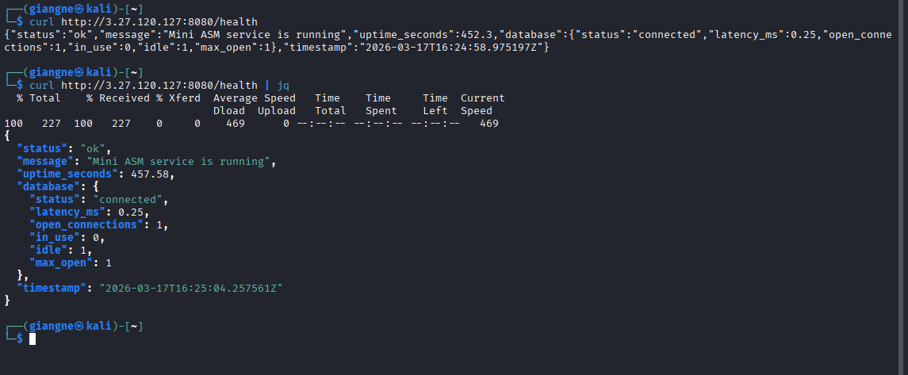
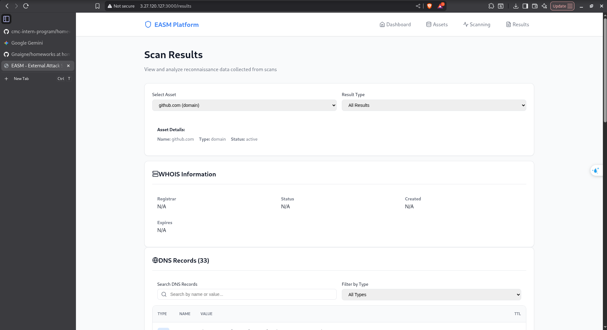

# Bài 7: Deploy ứng dụng lên Cloud AWS (Free Tier)

Ứng dụng đã được deploy thành công lên một máy ảo Ubuntu (EC2 instance) trên AWS (gói Free Tier). Dưới đây là các bước đã thực hiện:

## 1. Khởi tạo và Truy cập EC2 Instance
- **Khởi tạo EC2:** Đã tạo một máy ảo Ubuntu 22.04 LTS trên AWS.
- **Tạo cặp khoá SSH:** Đã tạo và tải xuống file `.pem` để kết nối an toàn với máy chủ.
- **Cấu hình Security Group (Firewall):** Mở các cổng cần thiết cho ứng dụng: 
  - `22` (SSH)
  - `80` (HTTP)
  - `443` (HTTPS)
  - Cổng của các service backend/frontend.

**Kết nối SSH vào máy ảo Ubuntu và xem các docker conyainers:**

## 2. Truy cập Ứng dụng qua Public IP
- Sau khi quá trình khởi tạo container hoàn tất, ứng dụng đã có thể truy cập qua trình duyệt và hệ thống API API.

**Kiểm tra trạng thái Backend (Health Check) qua Public IP:**

*(Sử dụng lệnh `curl` tới endpoint `/health` cổng 8080 qua Public IP để xác nhận Backend đang chạy ổn định và đã kết nối thành công với Database).*

**Trình duyệt truy cập trực tiếp Frontend bằng Public IP:**

*(Ứng dụng hiển thị giao diện Frontend đầy đủ khi truy cập qua địa chỉ IP của EC2).*

