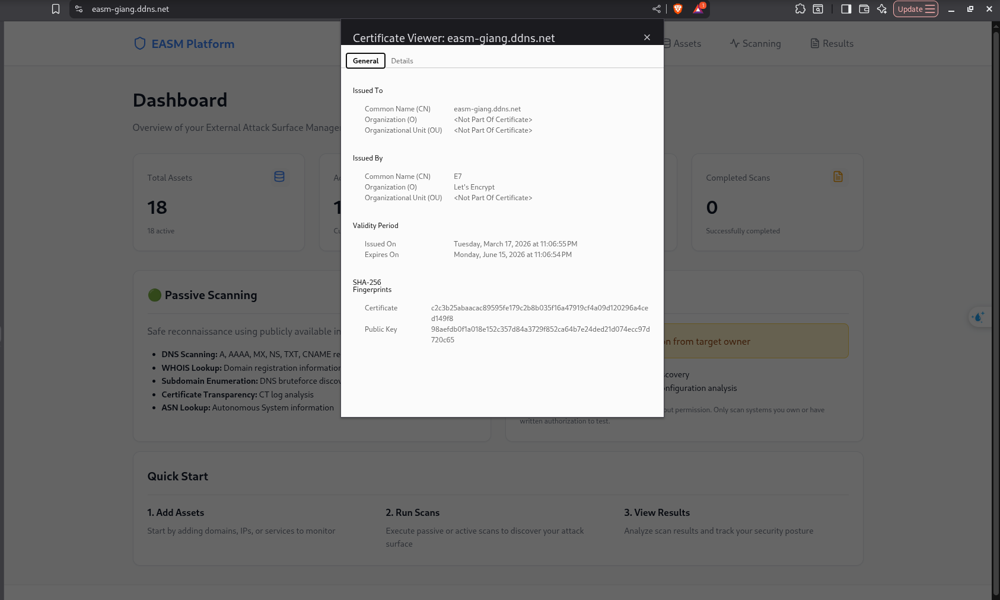
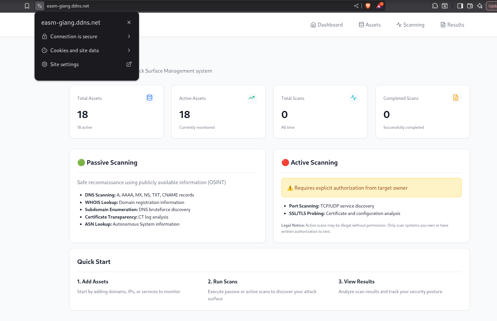
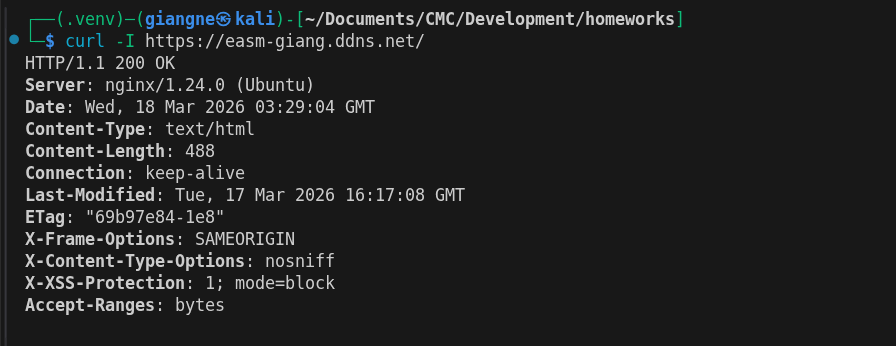

# Bài 8: Cấu hình tên miền và SSL (Let's Encrypt) 

## 1. Gắn tên miền (Domain Name)
- Đã cấu hình bản ghi `A` trên DNS trỏ từ tên miền quản lý (ví dụ: `easm-giang.ddns.net`) về địa chỉ Public IP của máy chủ AWS EC2.

## 2. Cài đặt Chứng chỉ SSL (HTTPS)
- Sử dụng Certbot kết hợp với Nginx để xin cấp phát chứng chỉ SSL tự động từ Let's Encrypt.
- Nginx được cấu hình làm Reverse Proxy để nhận request HTTPS (port 443) và điều hướng về ứng dụng nội bộ. Đồng thời, cấu hình tự động chuyển hướng (Redirect) các request HTTP (port 80) sang HTTPS.

### Minh chứng

**Truy cập ứng dụng bằng Tên miền với biểu tượng Ổ khoá HTTPS:**

*(Trình duyệt hiển thị kết nối bảo mật an toàn).*

**Chi tiết chứng chỉ SSL Let's Encrypt:**

*(Popup chứng chỉ minh chứng SSL hợp lệ, được cấp phát bởi tổ chức Let's Encrypt).*

**Kiểm tra phản hồi HTTP từ Terminal:**
Lệnh kiểm tra: `curl -I https://easm-giang.ddns.net/`

*(Terminal phản hồi `HTTP/1.1 200 OK` hoặc `HTTP/2 200`, chứng tỏ Server phản hồi bình thường qua cổng 443).*