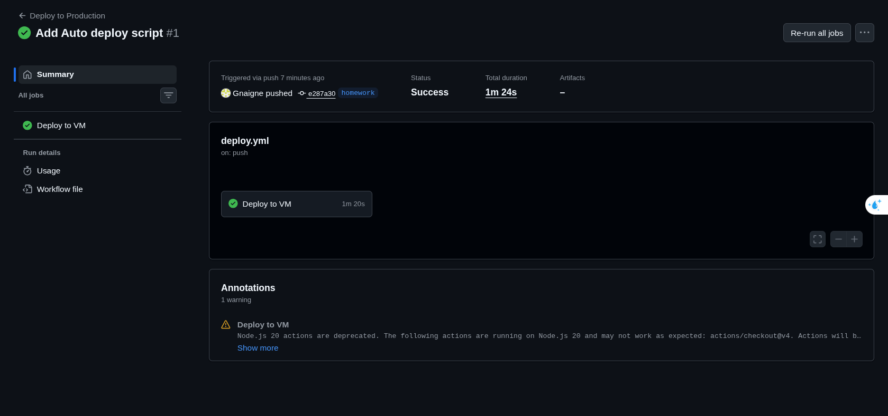
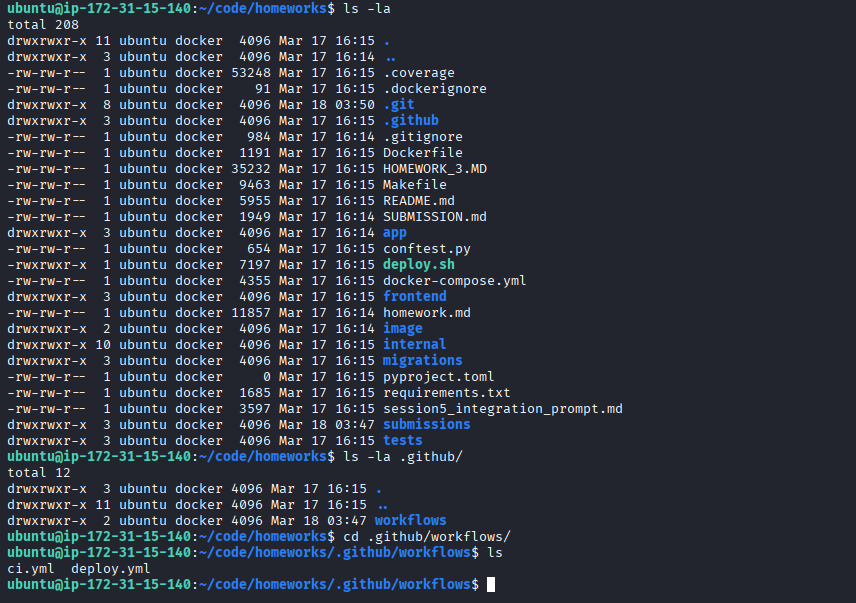

# Bài 9: Tự động hoá CI/CD với GitHub Actions

Ứng dụng đã được thiết lập quy trình Tích hợp và Triển khai liên tục (CI/CD) bằng GitHub Actions, giúp tự động hoá việc deploy code mới lên server mỗi khi có thay đổi.

## 1. Cấu hình Workflow GitHub Actions
- Đã tạo file `.github/workflows/deploy.yml` chứa định nghĩa cho pipeline CI/CD.
- **Trigger:** Workflow tự động kích hoạt khi có lệnh `push` (hoặc `merge`) vào nhánh `homework` (hoặc `main`).
- **Các bước thực hiện trong Workflow:**
  1. `Checkout`: Kéo bản cập nhật code mới nhất.
  2. `Deploy to Server via SSH`: Sử dụng action (như `appleboy/ssh-action`) để tự động SSH vào máy chủ AWS EC2.
  3. Máy chủ chạy các lệnh pull code mới từ GitHub và khởi động lại Docker container.

## 2. Thiết lập Bảo mật (GitHub Secrets)
Các thông tin nhạy cảm đã được khai báo bảo mật trong GitHub Settings > Secrets:
- `HOST`: Public IP/Tên miền của máy chủ.
- `USERNAME`: User truy cập (ví dụ: `ubuntu`).
- `SSH_PRIVATE_KEY`: Khoá bảo mật `.pem` để truy cập SSH.

### Minh chứng Workflow

**Quá trình chạy Job Deploy thành công trên GitHub Actions:**

**Ảnh chụp cho việc tự động update hoàn tất (Code mới có folder workflow trên VM AWS đã tự động được kéo về):**

